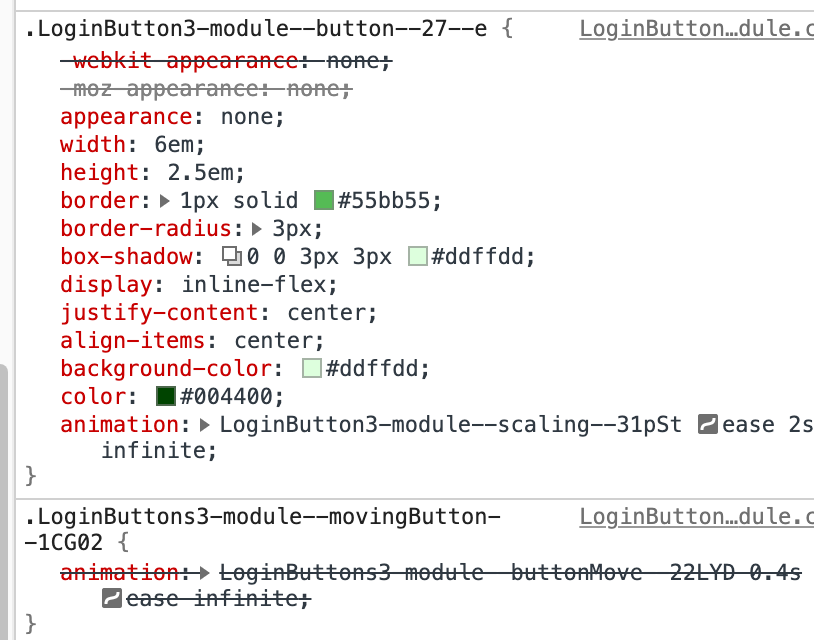

近年のフロントエンド開発には**コンポーネント**という概念が付いて回ります。React・Vue・AngularといったViewライブラリでは、コンポーネントを定義してそれを組み合わせてアプリを作ります。また、いわゆるWeb Componentsとして知られる仕様群により、ライブラリに依存せずに“コンポーネント”を作ることもできるようになってきています。

コンポーネントは、何らかの機能（あるいは**責務**）を持った部品です。また、コンポーネントによっては再利用される（アプリ内の複数の箇所から利用される）ことを意図しているものや、そもそもライブラリとして配布されているようなものもあります。アプリの機能の一部分を抜き出したものという見方をすれば、コンポーネントというのは**関数**にとても類似した概念であることが分かります。

コンポーネント設計によって、言い換えればアプリがどのような機能を持ったコンポーネントたちに分解するかによって、ソースコードのメンテナンスしやすさは大きく上下します。悪い設計のコンポーネントは、変更する際のコスト（修正対象箇所の断定、修正による影響範囲の断定、リグレッションが無いことの保証にかかるコスト等）が大きく、結果的にアプリケーションの保守開発の速度を悪化させます。実際のところ、アプリケーション開発の初期の段階では良い設計にこだわるよりも開発速度を重視したほうが動くものを早く作れるという説もあります。そうしたい場合は、初期の開発速度と引き換えに保守のコストを積み上げることになりますから、そのトレードオフについてよく検討して判断すべきでしょう。

さて、フロントエンド開発において、コンポーネントの責務はいくつかに分類されます。言うまでもなく、複数の種類の責務が入り混じったようなコンポーネントは設計が望ましくありません。

その中でもこの記事で注目したいのは**UIの提供**と言う責務、さらに具体的に言えば**描画された要素の見栄えに責任を持つ**という責務です。技術的には、**CSS**を利用する要素の描画を司るコンポーネントということになります。

この記事では、このようなコンポーネントの設計について考察します。特に、コンポーネントのスタイルを外から拡張可能にするべきかどうかについて筆者の考えを紹介します。ここからは筆者が詳しいTypeScript + Reactを例に用いていきます。

## classNameを渡してコンポーネントを拡張する

いきなりですが、見栄えに責任を持つコンポーネントの具体例を見てみましょう。緑色のボタンです。

import { LoginButton1 } from "./components/LoginButton1";

<p><LoginButton1 /></p>

コードはこんな感じです。CSSはいわゆるCSS Modulesを使っています。

```css
/* LoginButton.module.css */
.button {
  appearance: none;
  width: 6em;
  height: 2.5em;
  border: 1px solid #55bb55;
  border-radius: 3px;
  display: inline-flex;
  justify-content: center;
  align-items: center;
  background-color: #ddffdd;
  color: #004400;
}
```

```tsx
// LoginButton.tsx
import React from "react"
import styles from "./LoginButton1.module.css"

export const LoginButton = () => (
  <button className={styles.button}>ログイン</button>
)
```

では、ボタンにバリエーションが欲しくなった場合はどうするのが良いでしょうか。一つの方法は、外から`className`を受け取れるようにして、使う側に拡張を任せることです。`LoginButton`を次のように修正して、propsから受け取った`className`を`button`に適用するようにしてみましょう。

```tsx
// LoginButton.tsx
import React from "react"
import styles from "./LoginButton.module.css"

type Props = {
  className?: string;
};

export const LoginButton: React.VFC<Props> = ({ className }) => (
  <button className={styles.button + (className ? ` ${className}` : "")}>
    ログイン
  </button>
)
```

こうすることで、`LoginButton`のスタイルを必要に応じて自由に拡張できるようになりました。例えば、大きさが違うボタンや、色が緑ではなく赤のボタンを作ることができます。

```tsx
import React from "react"
import { LoginButton } from "./LoginButton"
import styles from "./LoginButtons.module.css"

export const RedLoginButton = () => (
  <LoginButton className={styles.redButton} />
)

export const BigLoginButton = () => (
  <LoginButton className={styles.bigButton} />
)
```

import { RedLoginButton1, BigLoginButton1 } from "./components/LoginButtons1.tsx"

<p><RedLoginButton1 /> <BigLoginButton1 /></p>

一見問題ないように見えますが、しばらく運用していくとこの方針には問題が発生します。例えば、デザインが変更してログインボタンにはbox-shadowをつけることになったとしましょう。

```css
.button {
  appearance: none;
  width: 6em;
  height: 2.5em;
  border: 1px solid #55bb55;
  border-radius: 3px;
  /* ↓これを追加 */
  box-shadow: 0 0 3px 3px #ddffdd;
  display: inline-flex;
  justify-content: center;
  align-items: center;
  background-color: #ddffdd;
  color: #004400;
}
```

すると、このようにログインボタンにいい感じのシャドウが付きました。

import { LoginButton2 } from "./components/LoginButton2/LoginButton2.tsx"

<p><LoginButton2 /></p>

ここで、先ほどの`RedLoginButton`を見直してみましょう。

import { RedLoginButton2 } from "./components/LoginButton2/LoginButtons2.tsx"

<p><RedLoginButton2 /></p>

なんと、そこには不気味な緑色に光る赤いボタンが！！！！！！

言うまでもなく、これは意図した表示ではありません。`RedLoginButton`はシャドウも赤いべきですね。結局、`LoginButton`に加えた変更によって、`RedLoginButton`の表示が思いがけず壊れてしまったことになります。

もう一つ別の例をお見せしましょう。今度の例では、CSSアニメーションを使ってログインボタンが動き回ることにしましょう。やることはこんな感じです。

```css
.movingButton {
  animation: buttonMove 0.4s ease infinite;
}
```

```tsx
export const MovingLoginButton = () => (
  <LoginButton1 className={styles.movingButton} />
)
```

これをレンダリングしてみると次のようになります。活きがいいですね。

import { MovingLoginButton1 } from "./components/LoginButtons1.tsx"

<p style={{textAlign: "center"}}>MovingLoginButton → <MovingLoginButton1 /></p>

さて、今度は元々の`LoginButton`にもアニメーションを追加したくなったとしましょう。拡大縮小して目立たせる狙いです。

```css
.button {
  appearance: none;
  /* (（（中略） */)
  color: #004400;
  /* ↓これを追加 */
  animation: scaling ease 2s infinite;
}
```

import { MovingLoginButton3 } from "./components/LoginButton3/LoginButtons3.tsx"
import { LoginButton3 } from "./components/LoginButton3/LoginButton3.tsx"

<p>LoadingButton → <LoginButton3 /></p>

どちらも`animation`を使っていて、すでに不穏な感じがしますね。では、このように修正した場合、先ほどのMovingLoginButtonはどうなるでしょうか。さっそく見てみましょう。

<p>MovingLoadingButton → <MovingLoginButton3 /></p>

何ということでしょう、あんなに活きがよかったボタンがただその場で拡大縮小するだけになってしまいました。使うコンポーネントを間違えたわけではありません。お察しの通り、拡張される側の`LoginButton`と拡張する側の`MovingLoginButton`で同じ`animation`プロパティを使ったのが原因です。調べてみると、次のスクリーンショットから分かるように、`MovingLoginButton`側の`animation`が`LoginButton`側の`animation`で上書きされてしまっています。



これもやはり、`LoginButton`側の修正によってそれを使う側の`MovingLoginButton`が意図せず壊れてしまった事例です。

## 責任はどのコンポーネントにあるのか？

では、この事象が起こってしまった原因はどこにあるのでしょうか。`RedLoginButton`と`MovingLoginButton`の場合発生している事象が少し違うので、別々に考える必要があります。ただ、共通して言えることもあります。

筆者の考えでは、そもそも`LoginButton`に`className`を受け取る機能を持たせたことが間違いです。それがなぜかというのは、`LoginButton`というコンポーネントの**責務**を考えてみれば分かります。

一旦`className`のことは忘れて考えれば、`LoginButton`の責務は「緑色のログインボタンを表示すること」です。「緑色の」とあるように、このコンポーネントは見栄え（スタイル）に関する責務を持っています。これは、`LoginButton`の実装の中にCSSがあることから分かる疑いようのない事実です。

次に、`LoginButton`が`className`を受け取るようになったことで、`LoginButton`に新たな責務が追加されました。それは「`className`を通じて自由にスタイルを拡張できること」です。「自由に」というのは、クラス名を通じてどんなCSSでも適用できることを表しています。

問題は、これが非常に難易度の高い責務であるということです。特に、後方互換性のある形でこの責務を全うし続けるのはほぼ不可能です。`MovingLoginButton`の例で考えてみると、この例では`LoginButton`の実装で`animation`プロパティを追加したことで、`MovingLoginButton`が`animation`を使って`LoginButton`を拡張することができなくなってしまいました。これは、この変更によって`LoginButton`が持っていた「`animation`プロパティでスタイルを拡張できる」という責務に反しています（上で述べたのは「自由にスタイルを拡張できる」でしたが、「自由に」なので当然これも含まれています）。つまり、`LoginButton`の実装に`animation`プロパティを追加するのは自らの責務の一部を放棄する後方互換性のない変更であり、`MovingLoginButton`が後方互換性のない変更の被害に遭ってしまったということになります。

このように、`className`で自由にスタイルを拡張できるようにしてしまったコンポーネントは、後方互換性のない形であとからCSSに変更を加えるのはほぼ不可能です。さらに言えば、`.class > div`のような他のDOM要素へのスタイル指定もできてしまうことから、コンポーネント内部のDOM構造を変更するのも後方互換性を損なう恐れがあります。汎用コンポーネントとして作られたコンポーネントならば後方互換性は重要ですから、一度作って使われ始めた汎用コンポーネントはもう修正できないということです。ライブラリとして公開した場合は、内部実装を変えるたびにメジャーバージョンを上げるのが誠実でしょう。

以上の説明から分かるように、`className`で自由にスタイルを拡張できるコンポーネントは、修正することができず、メンテナンス性の観点からはわざわざもはや再利用可能なコンポーネントとした意味が皆無です。一応、変更を加えるたびに全ての使用元を点検するならば可能ですが、その労力は非常に大きく、汎用コンポーネントを作る目的に正面から逆行しています。汎用コンポーネントというのは変更を一気に適用できることに意味があり、二度と書き換えない前提ならばわざわざ汎用コンポーネントを作らずに毎回コピペしても何の問題も無いのですから[^note_bundlesize]。

[^note_bundlesize]:　フロントエンドの話なので、汎用コンポーネントにした方がバンドルサイズを削減できるとかそういう事情はあるかもしれません。その場合、汎用コンポーネントを作る動機が増すことになるのでなおさら変更しやすい汎用コンポーネントを作らなければならないはずですが。

まとめると、`LoginButton`は`className`を受け取ることにより難しすぎる責務を背負ってしまい、それを全うできなかった結果として`MovingLoginButton`を壊してしまったということになります。

次に`RedLoginButton`の場合を考えてみましょう。`RedLoginButton`に起きた問題は、`LoginButton`に`box-shadow`を追加した結果このように`RedLoginButton`が描画するボタンの色が`box-shadow`の色と食い違ってしまったというものでした。

<p><RedLoginButton2 /></p>

この場合は、`LoginButton`と`RedLoginButton`の責務設計に問題があったと考えられます。`RedLoginButton`がやっていることは何だったでしょうか？　一見「`LoginButton`の色を赤に変える」だったように見えますが、そうではありません。より正確には、「`LoginButton`の背景色とボーダーカラーを赤に変える」でした。だから、`LoginButton`の仕様変更に対応できなかったのです。

そもそも、`RedLoginButton`は赤いボタンを表示するという目的を達成するためになぜ「背景色とボーダーカラーを赤に変える」という方法を選択したのでしょうか。明らかに、それは`RedLoginButton`が`LoginButton`の内部実装を知っていたからです。最初の`LoginButton`の実装を見れば、背景色とボーダーカラーを変えればボタンの色を変えられることが分かります。

ここにバッドプラクティスがあります。`RedLoginButton`が`LoginButton`の内部実装に依存した実装になっているため、両者の責務境界が曖昧になってしまっています。そのために、`LoginButton`の変更によって`RedLoginButton`が壊れるという事故が発生してしまいました。コンポーネントが別のコンポーネントの内部実装に依存するというのは、依存される側の後方互換性の維持が非常に困難になることを意味します。前述の議論と同様に、これではやはりコンポーネント分割した意味がありません。

そして、筆者は`LoginButton`が`className`を受け取るというインターフェースが、`LoginButton`の内部構造への依存を促進してしまっていると考えています。このインターフェースでは、2つのコンポーネントに由来するスタイルが同じDOM要素に同居することになります。このような状況でスタイルをうまく制御するためには内部構造（`className`を受け取る側のコンポーネントに由来するスタイル）を知る必要が生まれてしまうのは致し方ありません。

厳密なことを言えば、`className`を渡さなくても、CSSには子要素セレクタ（`>`）などもあるため親コンポーネントから子コンポーネント（が描画するDOM要素）にスタイルを注入することは可能です。これも明らかに子コンポーネントの内部構造に依存しているため避けるべきですが、子コンポーネントから取れる防御策は多くなく、人間の良心で防がなければならないのが残念なところです。どうしても防御が必要ならば、[筆者が開発したライブラリCastella](https://github.com/uhyo/castella)を使って子要素の中身をShadow DOMに入れることで外からの干渉を防ぐことができます。

## 望ましい解決法とコンポーネントのインターフェース

これらの問題の解決法は、言うまでもなく`className`を受け取るのをやめることです。そもそも`MovingLoginButton`の場合はわざわざ`LoginButton`に`className`を渡さなくても実装できますよね。次のように、`LoginButton`を別の`span`で囲んでそちらにスタイルを当てれば解決です。

```tsx
export const MovingLoginButton = () => (
  <span className={styles.movingButton}>
    <LoginButton />
  </span>
)
```

import { MovingLoginButton3Fixed } from "./components/LoginButton3/LoginButtons3.tsx"

<p style={{textAlign: "center"}}><MovingLoginButton3Fixed /></p>

動いていて分かりにくいですが、拡大縮小しながら動いていますね。

筆者の考えでは、この方法が使えるならばこれが最も望ましい解決法です。この場合`MovingLoginButton`の責務は「`LoginButton`を動かすこと」であり、どんな見栄えのボタンが動くのかについて関与しません。`LoginButton`がどのように書き換えられたとしても、`MovingLoginButton`はそれを動かすことができるでしょう。

一方、`RedLoginButton`の場合はそうもいかないでしょう。この場合、`LoginButton`で定義されている色を上書きする必要がありますが、これは`LoginButton`の内部構造を知らずに`RedLoginButton`の側から正しく行うことは不可能です。したがって、`LoginButton`の方で色の出し分けの責務を持つことになります。例えばこんな感じです。

```tsx
type Props = {
  color?: "green" | "red"
}

export const LoginButton: React.VFC<Props> = ({ color = "green" }) => (
  <button className={
    color === "green" ? styles.greenButton : styles.redButton
  }>
    ログイン
  </button>
)
```

この例からわかるように、**コンポーネントのインターフェースはコンポーネントの責務を明確にする役割を持ちます**。`LoginButton`が`color`を入力として受け取ることをインターフェースに明示したことによって、それぞれの`color`に対して正しい表示をする責任が`LoginButton`にあることが明確になりました。もし`LoginButton`という末端のコンポーネントが色に関する情報を持っているのが設計上望ましくなければ、いわゆるthemingなどの手段で解決していくことになります。

こうすることで、`LoginButton`に`box-shadow`を追加する場合、緑の場合と赤の場合の両方で期待通りの表示がされるように`LoginButton`が修正されることが期待できます。注意しなければならないことは、`LoginButton`は自身のインターフェースのみを見て実装されなければいけないことです。例えば、`LoginButton`の`box-shadow`の有り無しを制御できる`hasShadow?: boolean`というpropが追加されたとしましょう。このとき、`LoginButton`が対応しなければならないパターンは4パターンに増えます。例えば「`color`が`"red"`で`hasShadow`が`true`のパターンは存在しないから実装をサボろう」のような考え方をしてはいけません。なぜなら、これは`LoginButton`の内部実装が、`LoginButton`を使う側に依存してしまうことになるからです[^note_type]。

[^note_type]: もし本当に`color`が`"red"`で`hasShadow`が`true`のパターンをサポートしないならば、それを明示した型をインターフェースにしましょう。TypeScriptならそのような型定義が可能です。

改めて考えると、`LoginButton`が`className`を受け取るというのは「どんなスタイルが来ても対応します！」という宣言であり、非常に大言壮語です。上の例の`color`のように、自分で責任を持てる範囲で拡張可能性を持たせるべきであるというのが筆者の考えです。

ただ、別の問題として、いろいろな需要に対応しようとするとpropsが増えてしまうという問題も考えられます。いろいろな入力を受け取るようになると、前述の通り`LoginButton`の責任が掛け算で増加していくことになるため、現実的に保証できる範囲をすぐに超えてしまいますね。

これに対する根本的な解決策はデザインシステムを整備することです。デザインのパターンを現実的にメンテナンス可能な形に抑えて制御することにより、その実装にかかる責任も自ずと制御されるでしょう。それが難しい場合は、そもそも解決しようとしている問題が難しいためどうにもならない面もありますが、コンポーネントを別々にして責任範囲を小さくするといった対症療法をとることになるでしょう。

まとめると、コンポーネントのインターフェースはそのコンポーネントの責務の定義です。インターフェースを切った以上、そのインターフェースに従って入力された要求を適切に処理する責任はそのコンポーネントにあります。責任を持てない入力を受け取るべきではありません。そうしなければ、コンポーネント間の責務境界が崩壊し、コンポーネントが互いの内部実装の依存しあいメンテナンスが困難になってしまうでしょう。

とはいっても、現実的にはエスケープハッチとして`className`の注入が必要な場面があるかもしれません。そういった場合の筆者のお勧めは、`className`の使用に対して責任は持たないとコンポーネント側で宣言することです。例えばprop名を`dangerouslySetClassName`などにするとよいでしょう（もちろんコメントやドキュメント等で責任を持たない旨を書いておくことも必要です）。

## スタイルを責務としないコンポーネントについて

一つ思い出していただきたいのが、この記事での考察対象はスタイルを責務に持つコンポーネントたちだったということです。では、そうではないコンポーネントの場合はどうでしょうか。ちょうどよい例としては**[Headless UI](https://headlessui.dev/)**が挙げられます。これは、「スタイルに関する責務を**持たない**」ことを明示的に掲げた汎用コンポーネント群を提供するライブラリです。一つHeadless UIのexampleから引用します。

```tsx
<Switch
  checked={enabled}
  onChange={setEnabled}
  className={`${
    enabled ? 'bg-blue-600' : 'bg-gray-200'
  } relative inline-flex h-6 rounded-full w-8`}
>
  <span className="sr-only">Enable notifications</span>
  <span
    className={`${
      enabled ? 'translate-x-4' : 'translate-x-0'
    } inline-block w-4 h-4 transform bg-white rounded-full`}
  />
</Switch>
```

`Switch`がHeadless UIのコンポーネントですが、おや、`className`を受け取っていますね。これは良いのでしょうか。

筆者の意見では、100点満点とは言えませんが、悪いコンポーネント設計ではないと考えています。

その理由を考えるためには、この`Switch`コンポーネントが受け取った`className`に対してどのような責務を負っているのか考えてみてください。`Switch`の責務はトグルスイッチを表すDOM要素たちを描画することであり、セマンティクスやアクセシビリティ的に正しいものを描画できるのが売りです。つまり、`Switch`の責務はDOM要素を描画することであり、`className`に対して負っている責務は「描画されたDOM要素に渡された`className`を持たせること」でしかないと解釈できます。言い換えれば、`Switch`自身がスタイルに責任を負っていないゆえに、スタイルのソースが二重になるという問題を回避しています。

これにより、`Switch`に渡される`className`によってどのような見栄えになるかに関する責任は`Switch`を使う側のみが持つことになります。これならこの記事で述べたような問題を回避することができます。

では、100点満点ではないというのはどの部分を指しているのでしょうか。これは、スタイルはCSSだけでなくDOM構造にも依存してしまう点を危惧しています。つまり、`className`によって渡されたスタイルが、`Switch`によって描画されるDOMの構造に依存してしまう可能性を捨て切れません。これは`Switch`を使う側が悪いとも言えますが、コンポーネントを使う側で気をつけるというのはベストな解決策とは言えません。

ただ、上の例からも分かるように、Headless UIは[Tailwind CSS](https://tailwindcss.com/)と組み合わせることを意図して作られています。Tailwind CSSのみを使っている限りはこのような問題は発生しにくいと考えられます。Headless UIを使うならおとなしくTailwind CSSと組み合わせるのが安全ということですね。

## まとめ

この記事では、スタイルを司るコンポーネントが`className`を受け取ることによって発生する諸問題について議論しました。コンポーネントは自身のインターフェースに責任を持つべきであるという観点と、コンポーネントは他のコンポーネントの内部実装に依存するべきではないという2つの観点から、コンポーネントが`className`を持つべきではないという筆者の考えを紹介しました。