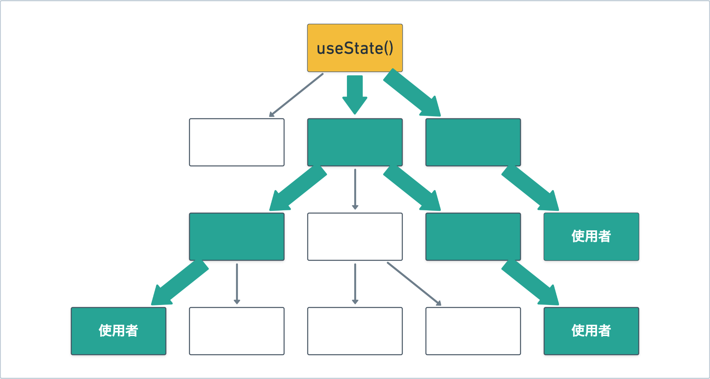
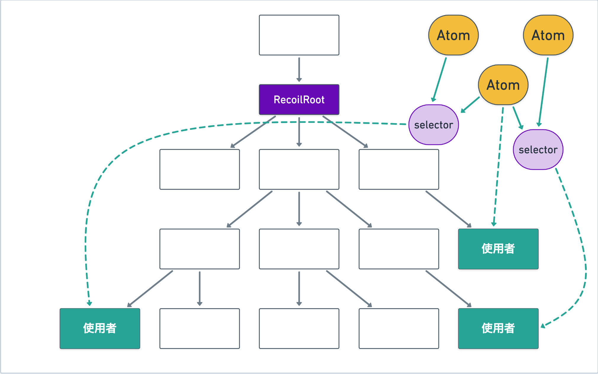
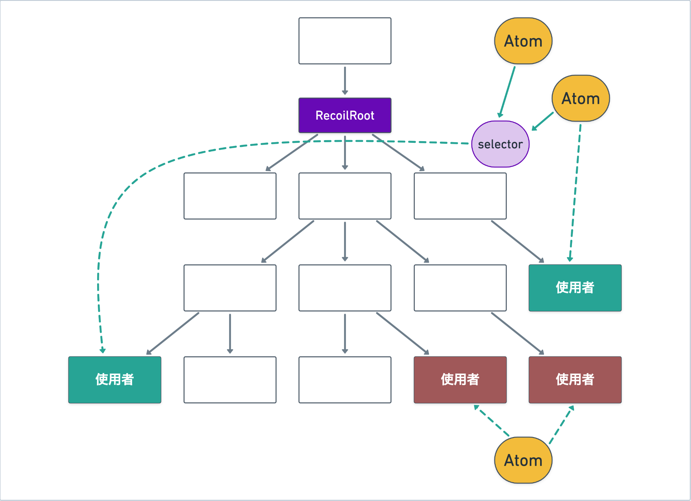
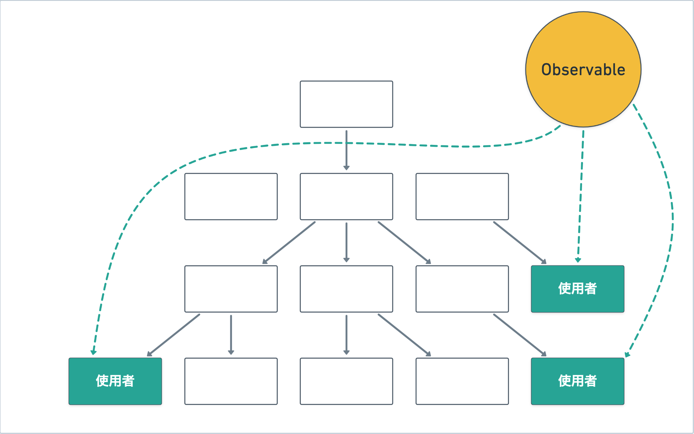

こんにちは。Reactの話題の中でもかなりの部分を占めるのがステート管理、さらに言えば各種のステート管理ライブラリです。今さらながら、Reactにおけるステート管理の手法やいくつかのステート管理ライブラリを比較考察して記事にまとめました。

## `useState` + バケツリレー

Reactにおける基本的なステート管理は`useState`です。ひとつのコンポーネント内で完結するようなステートならば`useState`は非常に適しており、他の選択肢はほぼ無いと言っても構わないでしょう。

ステートをアプリケーションの広範囲で使いたい場合が問題です。次の画像に例示されるように、分岐したコンポーネントツリーの末端のコンポーネント（使用者）で同じステートを参照したい場合を考えます。

`useState`と組み合わせる場合、もっとも原始的な方法はpropsのバケツリレーによるものです。propsは親コンポーネントから子コンポーネントへの情報伝達の手段であり、Reactにおける最も基本的なコンポーネント間コミュニケーション手段です。これを図示したのが次の画像です。

プレーンなReactにおけるコンポーネント間の情報伝達は「親から子」が原則です。よって、複数のコンポーネントで共有されるステートは、必然的に共通祖先のコンポーネントに保持されることになります。上の図ではコンポーネントツリーの頂点にあるコンポーネントがステートを保持しています。このステートは末端の使用者までバケツリレーによって伝達されます（画像の太い矢印）。

なお、使用者側でステートを更新する必要がある場合は、ステートを更新する関数をやはりpropsで使用者まで伝達することになります。

### `useState` + バケツリレーの特徴: 責務の観点から

この方法の特徴は、**ステートの伝達に係る責務がステートの直接の使用者以外にも発生する**ことです。図では、上からステートを受け取ってそのまま下に流しているコンポーネントたちがこれに相当します。

一般に、コンポーネントは受け取るpropsをインターフェースとして明示します。インターフェースはそのコンポーネントの責務を表すものですから、コンポーネントにはそのpropsを受け取り適切に用いるという責務があることになります。

実際にこれらのコンポーネントが行なっているのは「propsを子に渡す」ということだけですが、Reactコンポーネントの場合「受け取ったpropsをどう使うか」ということ自体はコンポーネントの内部実装の範疇ですから責務ではなく、むしろ「渡されたpropsに応じて適切なUIを出し分ける」ことが責務となります。つまり、実際にはpropsで渡されたステートをバケツリレーしているだけのコンポーネントであっても、**インターフェース（責務）上はそのステートのれっきとした使用者となります**。

つまり、`useState` + バケツリレーという手法ではステートを子に渡すだけのコンポーネントと、本当にステートを使用するコンポーネントが、インターフェース上区別できないことになります。次の図のように、**実際の使用者に比べてインターフェース上のステート使用者が多くなります**。これが`useState` + バケツリレーという手法の特徴です。

よって、`useState` + バケツリレーという手法を採用するかどうかは、上記が実態と乖離するかどうかで決めればよいでしょう。すなわち、（バケツリレーの途中のコンポーネントも含めて）実態としてコンポーネントツリー上の多数のコンポーネントがステートを使用しているならば、`useState` + バケツリレーは適しています。一方、実際にはステートを使用しないがpropsに含んでいるというコンポーネントが多い場合、インターフェースと実態が乖離してしまう状況を生み出してしまうため、`useState` + バケツリレーは適していません。

### 即物的な見方

以上はインターフェース・責務というやや抽象的な観点から分析しましたが、これを基により即物的な見方をしてみましょう。

まず、`useState` + バケツリレーはパフォーマンス上不利になる可能性があります。使用者までの途中のコンポーネントも含めて多くのコンポーネントが実際にpropsとしてステートを受け取るということは、（たとえ`React.memo`などで再レンダリングを抑制していたとしても）ステートが変化した際にはそれらのコンポーネントが再レンダリングされることになります。これにより、実際に必要なよりも多くのコンポーネントがレンダリングされることになります。

また、リファクタリングの過程でステートの型や名前（propsの型や名前名前）が変わることも考えられます。その際、そのステートの型や名前をインターフェースに含んだコンポーネントが多ければそれだけ多くのコンポーネントを変更しなければなりません。これはいわゆる凝集度が低くなってしまっていることを表しています。

以上のことから、パフォーマンスやコードのメンテナンス性を重視する場合は、`useState` + バケツリレーは推奨されません。

## `useContext`の使用

`useState` + バケツリレーの問題点を避けたい場合、プレーンなReactで可能な選択肢として`useContext`の使用が挙げられます。`useContext`は、props以外でコンポーネント間の伝達を可能にします。ただし、「親から子」という原則は維持されます。

次の図は、`useContext`を使用した場合のステートの伝達を示しています。

「親から子」の原則のため、実際のステートがコンポーネントツリーの頂点にあるという点はバケツリレーの場合と変わりません。コンテキストを使用する場合の特徴は、Providerというコンポーネントが使用者たちの上位に存在する点です。Providerの下にある子コンポーネントは`useContext`によりステートの中身を取得することができます。これを表しているのが図中の点線であり、間にあるコンポーネントを介さずにProviderから直接ステートを取得できることを示しています。

なお、図に緑の太い矢印で示されているように、`useState`を擁するコンポーネントからProviderへの伝達はやはりpropsを使うことになります。

### インターフェースの観点からの考察

インターフェース（コンポーネントが受け取るprops）の観点で見ると、もはやこのステートはコンポーネントのpropsに現れません。途中のコンポーネントはもちろんのこと、使用者であるコンポーネントもステートをpropsではなく`useContext`で受け取ります。このことから、ステートを使用することはもはやコンポーネントの責務ではなく、コンポーネントの内部処理の一部であると見なされます。

言い方を変えれば、context由来のステートは一種の外部ソースと見なされるということです。普段、色々なコンポーネントがReactの世界から抜け出してDOMやネットワークと直接連携したりしていますが、これらが外部ソースに相当するものです。Contextは、propsではなく`useContext`で取得する都合上、Reactの機構の一部とはいえこのような外部ソースに近い性質を持ちます。

つまり、contextから必要なステートを得るコンポーネントは、インターフェース上はたとえば外部のサーバーから情報をfetchするコンポーネントと似た振る舞いをするということです。問題点としては、このようにコンポーネントの内部実装の一環として外部ソースを取得する場合、テストのしやすさにやや難があることが挙げられます。

このことが気に入らない場合は、いわゆる「containerコンポーネントとpresentationalコンポーネント」のような概念を持ち出すことである程度解決できます。この場合、containerコンポーネントはどこからともなく（実際にはcontextから）ステートを持ってくるだけの薄いコンポーネントとなり、presentationalコンポーネントはcontainerコンポーネントからpropsで渡されたステートを描画するという責務を持つことになります。このように責務を分割することでテストが少しやりやすくなります。

### 即物的な考察

パフォーマンスの観点からは、`useContext`のほうが`useState` + バケツリレーよりは有利です。なぜなら、`useContext`を使うことで、ステートが変わった際には本当にそのステートを使用しているコンポーネントのみが再レンダリングされるようになるからです。コンポーネントツリーの頂点と使用者の間にある中間コンポーネントは、`useContext`を使っていなければ再レンダリングされません[^note_memo]。

[^note_memo]: ただし、デフォルトでは親コンポーネントが再レンダリングされた場合は子コンポーネントも自動的に再レンダリングされます。これを防ぐには`React.memo`を適切に使用する必要があります。この記事では`React.memo`を必要に応じて使用することを前提としています。

しかし、コンポーネント間で共有されるステートが複雑化してくると、不満が出てくるでしょう。グローバルに使用されるステートが複数種類ある場合、それぞれで使用者も異なります。その場合、ステートの種類に応じて別々のProviderを用意しなければいけません。図で表すと次のようになります。

このように、3つの種類のステートがありそれぞれ使用者が異なる場合、3つのコンテキスト（そして3つのProvider）を用意する必要があります。あるコンテキストのステートの中身が更新された場合は、それを使用しているコンポーネントのみが再レンダリングされ、他のコンテキストの使用者は影響を受けません。

ステートの共有を複数のコンテキストに分ける目的は、ステート更新に伴う再レンダリングを最小化することです。1つのコンテキストから`useContext`からデータを得るコンポーネントたちは、データが更新されたら一斉に再レンダリングされます。パフォーマンスのために無駄な再レンダリングを細かく減らしていきたい場合、それだけ多くのコンテキストが必要になります。面倒だということで一つのコンポーネントに色々なステートを突っ込んでしまうのもありますが、そうするとステートが巨大化するにつれてコンテキストの利用によるパフォーマンス上の利点が低減していきます。

まとめると、`useState` + `useContext`でグローバルなステート管理をする場合は、**たくさんのコンテキストを管理しなければならない**か**パフォーマンスの低下**かどちらかを受け入れなければならないということです。逆に言えば、これを受け入れられるなら`useState` + `useContext`は有効です。次以降で説明するような別のライブラリが必要ないという利点もあります。特に、コンポーネントツリーの規模があまり大きくないのであればパフォーマンスの低下については許容範囲となる場合もあるでしょう。

## react-redux

ここからはステート管理ライブラリを使う場合を見ていきます。まずは、React向けステート管理ライブラリとしては随一の知名度を誇る（要出典）[react-redux](https://github.com/reduxjs/react-redux)です。アーキテクチャを図で示すと次のようになります。

注目すべきは、ステートの実態がコンポーネントツリーの外部にあるStoreにあるということです。図中の点線が示すように、ステートを使用するコンポーネントはStoreから直接subscribeします（Storeに更新があった際に再レンダリングします）。多くのReact向けステート管理ライブラリに共通する特徴として、Reactに組み込みの手段に依らずにステートの更新を取得・再レンダリングするということが挙げられます。むしろ、このことがステート管理ライブラリを使用する理由であると言っても過言ではありません[^note_usemutablesource]。

[^note_usemutablesource]: ただし、`useMutableSource`という新しいフック（まだリリースされていませんが、すでにReactのmainブランチにはマージされています）を使うことで、このようなsubscriptionベースの再レンダリングもReactに組み込みの方法で行うことができるようになる見込みです。

react-reduxの特徴として、ステートの使用者にそれぞれ**selector**がくっついています。APIとしては、selectorというのは`useSelector`フックに渡される関数であり、ステート（Storeで管理されている全てのステート）のうち使う部分だけを選んで返す関数です。Storeに接続している使用者たちは、Storeのステートが更新されても、そのコンポーネントが使う部分（selectorsで返される値）が変化しない限りは再レンダリングされません。

これにより、`useSelector`を使っていれば自動的に再レンダリングが最適化されます。このように関数を用いて再レンダリングを制御するのは`useContext`やそれを組み込んだカスタムフックでは再現できない挙動であり（コンテキストを量産するなら別ですが）、外部のStoreのsubscriptionという手段でこれを行えるということがreact-reduxが提供する主な価値です。

Reduxの他の特徴として、ひとつの大きなStoreにステートが集約されているということが挙げられます。あらゆる使用者のためのステートが含まれる大きなデータがStoreに含まれており、selectorはそのデータから必要な部分のみを取り出すというデザインになっています。

なお、図には依然としてProviderが登場していますが、これの役割は「どのStoreに接続すればいいか」という情報を配下のコンポーネントに伝達することであり、ステート自体を伝達しているわけではありません。上述の通り基本的にStoreはひとつであるため、このProviderによる再レンダリングについては考える必要はありません。

### インターフェース・アーキテクチャの観点から

react-reduxを使用する場合、コンポーネントがステートを取得するのは`useSelector`フックにより行います。よって、コンポーネントのインターフェースについては`useContext`の場合と同様の考察が当てはまります。つまり、Storeからステートを取得するのはコンポーネントの内部処理の一環であることは変わらず、テストのしやすさといった観点からも特に差はありません。

今回注目に値するのは、新たに登場したStoreという要素です。Storeは（react-reduxではなく）reduxの要素で、ステートを内包するミュータブルなオブジェクトです。スタンダードな読み取り用のAPI（`getState`・`subscribe`）と更新用のAPI（`dispatch`）を持っています。

Store自体はミュータブルなものですが、react-reduxによってReactのアーキテクチャに合う形で繋ぎこまれています。この“繋ぎ込み”はreduxに特有なものではなく、`getState`と`subscribe`が提供される外部ソースを読んで適切に再レンダリングするコンポーネントを作ることはReactの練習問題レベルの課題です。しかし、`useSelector`にselectorを渡せたり、selectorの中でpropsを使用できることに関連して[細かな問題もあり](https://react-redux.js.org/api/hooks#stale-props-and-zombie-children)、その辺りをできる限りハンドリングしてくれるところにreact-reduxのライブラリとしての意味があります。

Reduxといえばreducerやactionといった要素が知られていますが、これらはStoreの材料であり、ステート管理という観点からは脇役であるため上の図には登場していません。特にactionに関しては、ステート更新の手段として見るとやや冗長だというのが筆者の意見です。actionの本領は、redux middlewareを絡めたメッセージパッシングアーキテクチャを提供しているという点にあると考えられます。筆者の意見では、このようにReduxにはステート管理の側面とメッセージパッシングの側面という2つの異なる責務が同居していると考えられます。この記事ではステート管理の側面のみに注目しています。

ただし、更新用のための関数（`dispatch`）を取得する方法として`useSelector`とは独立した`useDispatch`が与えられている点は注目に値します。`useSelector`を使わず`useDispatch`だけを用いるコンポーネント（ステートを更新する専門のコンポーネント）は、Store内のステートが更新されても再レンダリングされません。`useContext`で同じことを実現するには、ステートを伝達するコンテキストとステート更新関数を伝達するコンテキストを別々にする必要がありましたが、react-reduxではこのように組み込みでベストな手段が用意されています。

ステート管理としてのreact-reduxの特徴をまとめ直すと、コンポーネントツリーの外部のステートを保管し、独自のサブスクリプションによりステートの更新時の再レンダリングを制御することで、**最適化された再レンダリングがローコストで提供される**という点が第一の特徴です。ただし、最適化された再レンダリングはステート管理ライブラリとしての基本要件といったところがあり、react-reduxに特有のものとは言えません。

React-reduxに特有の点としては、（グローバルに共有される）**すべてのステートを一つのStoreで管理し、selectorによってそこから必要なものだけを取り出すというインターフェース**が特徴となります。特に、selectorの型が`(state: 全てのステート) => 必要なステート`のような型となり、ステートの使用者は常に全体のステートを意識させられます（適宜カスタムフックを用意することでこの点はある程度緩和できますが）。

## Recoil

ここでは、react-reduxに対比されるステート管理ライブラリとしてRecoilを取り上げます。Recoilは、パフォーマンス的な観点からはreact-reduxと類似した特性を持つ一方で、大きく異なるインターフェースを提供します。

上に示したRecoilの概念図は、RecoilにおいてはステートはAtomと呼ばれるものがステートの保管を担当していることを示しています。コンポーネントは、Atomに対してsubscribeすることができます（図中の点線）。

また、Selectorという概念が存在し、これはAtom（や別のSelector）からsubscribeして自分自身の値を計算します。コンポーネントは、AtomからだけではなくSelectorからのsubscribeも可能です。Selectorを使うことで、複数のAtomのデータを合成して必要なデータを計算することも可能です。AtomとSelectorを総称してRecoilStateと呼びます。

当然ながら、AtomやSelectorに対してsubscribeした場合の再レンダリングは最適化されます。つまり、Atomに対してsubscribeしている場合、Atomのデータが変化した場合のみコンポーネントが再レンダリングされます。また、Atom→Selector→コンポーネント というsubscriptionの列の場合、Atomの内容が変化した場合はSelectorの内容が再計算されますが、その結果が以前と変わらなかった場合はコンポーネントの再レンダリングは行われません。このことから、Atomのデータ更新よりもさらに細かくコンポーネントの再レンダリングを制御したい場合、このように間にSelectorを挟むことができます。

### アーキテクチャ上の特徴

上の図にあるように、Recoilをreact-reduxと対比した場合、全てのステートが一箇所にまとまっていないという点が特徴となります。データのソースとなるAtomが複数存在しているという状況がRecoilでは普通に起こります。このことは、reduxでは不可能だった「ステートのcode splitting」を可能にします。[Recoilの公式サイト](https://recoiljs.org/docs/introduction/motivation)にもこのことが“The state definition is incremental and distributed, making code-splitting possible.”としてアピールされています。

先ほどの図では右上にAtomがまとまっていましたが、次の図のように、コンポーネントツリーの末端でちょっとだけ使われる（しかし複数のコンポーネントで共有される）ようなユースケースにもRecoilは適しています。

Reduxのように全ての共有ステートが大きなStoreに保存される方法だと、このような末端のちょっとした共有ステートのためにステートを追加するのはためらわれます。しかし、Recoilではこのような場合でも自然かつ気軽に共有ステートを作成可能です。ステートのソースを分散させる場合、このようなアーキテクチャ上の利点があります。しかも、適切なcode splittingが行われていれば、Atomはそれを参照するコンポーネントが読み込まれるまでは読み込まれません。パフォーマンス上の利点もあるわけですね。

Recoilのアーキテクチャ上の面白い点は、以上のようなAtom・Selectorの概念がローレベルかつ柔軟性のあるものとして提供されている点にあります。というのも、Recoilを部品として使うことで、思いのままのアーキテクチャを作ることができます。さらには、主に非同期処理に関連してselectorから別のselectorを作るヘルパー関数も提供されており、部品という側面が強調されています。

例えば、ひとつの大きなAtomにステートを詰め込むことで、あえてReduxのようなアーキテクチャでRecoilを運用することもできるでしょう（下図）。この図ではAtomが一つで、各使用者に対応したSelectorが用意されています。これは先ほどのreact-reduxの場合ととても類似した運用です。

このように、Recoilが提供する部品を使うことで、思いのままのアーキテクチャを構成することができます。プロジェクト構成においても、AtomやSelectorをどこに置くのか、専用のディレクトリにまとめておくか、あるいは使用者たるコンポーネントの隣にSelectorを置くかなど、ローレベルゆえに選択の余地があり、この点は今後のさらなる研究が待たれます。

Recoil自体は比較的新しいステート管理ライブラリであることもあり、APIはHooksを活用した近代的なものになっています。その上非同期処理に関する優れたサポートもあり、React 18での導入が予定されているSuspense・Concurrent Renderingとの親和性も期待できます。

他にも、`atomFamily`・`selectorFamily`というAPIでAtomやSelectorの動的な生成もサポートしており、動的なステート管理を含むロジックもRecoilで達成可能です。

まとめると、Recoilは**Atom・Selectorというシンプルな概念をベースとし、特定のアーキテクチャを強制することなくグローバルなステート管理の部品を提供してくれる**点が特徴です。subscriptionの管理などの面倒な部分をRecoilに任せつつ、思いのままのアーキテクチャでステート管理を行うことができるでしょう。

ちなみに、上の図ではAtomにステートが保存されているように見えますが、実際の保存先はRecoilRootです[^note_recoilroot]。より正確には、AtomやSelectorはデータの流れを定義したDAG (Directed Acyclic Graph) のノードであると理解しましょう。この見方をすると、新たなステート定義をホットプラグして追加できるのがRecoilの特徴であるとも言えます。

[^note_recoilroot]: このことは、別々の`RecoilRoot`下にあるコンポーネントで同じAtomを使用してみれば分かります。両者の間でステートは共有されません。

## mobx-react-lite

もうひとつのステート管理ライブラリの例としてmobx-react-liteを取り上げてみます。これは名前の通り、MobXのReactバインディングです。liteというのはHooksベースのAPIのため関数コンポーネントしかサポートしないことを指しています。

MobXではステートはミュータブルなオブジェクトであり、そのオブジェクトに破壊的変更を行うことでステートの更新を表します。これまでに紹介した方式たちはこれとは対照的で、`useState`、Store、Atomといった「ステートの入れ物」が存在し、実際のステートはただのイミュータブルなオブジェクトであり、ステートの更新は別のオブジェクトを用意することで行われました。MobXではこれらのための「ステートの入れ物」や「ステートの更新関数」といった概念が必要なく、ステートを直に読み書きできることを売りとしています。[公式ドキュメント](https://mobx.js.org/README.html)ではこれを“Straightforward”と表現しています。

この記事の観点からは、これまでのステート管理ライブラリと比較すると、MobXでは**ステートに対するサブスクリプションが暗黙に行われる**という点が大きな違いとして挙げられます。MobXではステートを表すオブジェクトは**observable**に加工されます。また、コンポーネントはそれを参照するobserverとして宣言されることになります。Observerがobservableなオブジェクトに対して`obj.foo`のような普通の参照を行うことで、`foo`に対する暗黙の依存性が検知されます。そして、そのプロパティに値が変更された際に自動的に該当するobserverが再レンダリングされます。この機構により最適化された再レンダリングを実現しています。

つまり、MobXではコンポーネントがステートへの依存を表現する手段が`obj.foo`のような通常のプロパティ参照[^note_mobx_map]であり、依存性の宣言にpropsや`useContext`、`useSelector`などの明示的なAPIを用いません。

[^note_mobx_map]: MobXでは普通のオブジェクト以外にも配列やMap, Setもステートとしてサポートされており、それらの中身を得る操作は同様に暗黙の依存性として検知されます。

MobXによるステート管理のアーキテクチャをこれまでと同様に図で表すと次のようになります。しかし、MobXの場合はこの図は一例にすぎません。

というのも、コンポーネントがどのようにステート（observable）を参照するのかは決まっておらず、いくつかの手段が考えられるからです。上の図では、もっとも単純なパターンとして**observableをグローバル変数として配置する**場合を想定しています。つまり、Observableとしておいたオブジェクトをグローバルな位置に置いておき、ステートを使用するコンポーネントはobserverとして宣言さえしておけば、あとはそのオブジェクトを普通に読むだけで最適化された再レンダリングが提供されます。

他の方式として、observableをpropsやコンテキストで渡すなどの方法も考えられます。これらの場合、この記事の序盤で紹介した`useState` + バケツリレーや`useContext`の方式をベースとしつつ、パフォーマンス上の欠点をMobXの最適化された再レンダリングで補うという構成になります。

このことから、**MobXはステート管理全体ではなく再レンダリングの最適化に特化したパーツを提供している**という見方もできるでしょう。

ただし、個人的にはMobX + Reactは使い勝手の面でやや劣ると考えています。まず、MobXによる最適化された再レンダリングの恩恵を受けるためには、コンポーネントを全部observerと明記しなければいけません。これはMobXが依存関係をトラックできるようにするためには必要なことですが、とても手間です。また、先ほども述べたようにステート更新へのサブスクリプションが暗黙的に行われるため、`obj.foo`のようなただの参照が副作用を持つことになります。これはReactの考え方とあまり適合していません。さらに、本当に再レンダリングを最適化したければコンポーネントツリーの中でこの副作用をどこで起こすか細かく制御しなければならず、メンテナンス性がかなり下がります（[MobXの公式ドキュメントにOptimizing React component renderingとして実例が載っています](https://mobx.js.org/react-optimizations.html)が、結構つらいので見てみましょう）。

## まとめ

この記事では、いくつかのステート管理ライブラリを含む、Reactにおけるステート管理手法について比較・分析しました。短くまとめると以下のようになります。

- `useState` + バケツリレーは、ステートを中継するだけのコンポーネントも含めて、ステートの使用者がインターフェース（props定義）上明示される点が特徴的です。
- `useContext`は、ステートへの依存がコンポーネントに内部化される点がバケツリレーとの違いで、この特徴はほぼ全てのステート管理ライブラリにも受け継がれます。`useContext`単体ではパフォーマンス的にベストではなく、不満がある場合はステート管理ライブラリに頼ることになります。
- react-reduxはステートがStoreに外部化され、全てのステートが1つのStoreに集約されるアーキテクチャが特徴です。react-reduxも含めた多くのステート管理ライブラリは、再レンダリングのパフォーマンスの観点からは最適です。
- Recoilはステートを複数のAtomに分散させることができます。プリミティブなAPIにより、アーキテクチャを強制しないステート管理の部品を提供します。これにより、最適なアーキテクチャを構築する助けになります。
- mobx-react-liteはステートへの依存が暗黙的かつ副作用である点に特徴があります。再レンダリングの最適化という点のみに特化しており、Recoilとは別の意味でステート管理の部品として働きます。

### Q &amp; A

- （ここに好きなライブラリを入れよう）はどうなの？
  - 筆者にお問い合わせください。この記事に追加されるかもしれません。
- [jotai](https://docs.pmnd.rs/jotai/introduction)はどうなの？
  - アーキテクチャ的にはRecoilと同じです。ドキュメントの最初にまずRecoilとの比較があり、違いとしてアーキテクチャレベルではなくAPIの相違が主に挙げられていることから分かります。
- [SWR](https://swr.vercel.app/)や[React Query](https://react-query.tanstack.com/)のようなデータフェッチングライブラリでステートを管理するのはどうなの？
  - これについては[React Queryのドキュメントに“Does React Query replace Redux, MobX or other global state managers?”というページがあり](https://react-query.tanstack.com/guides/does-this-replace-client-state)、参考になります。
  - 実際、これらのライブラリはある種のステートを提供します。もちろん、フェッチしたデータが入っているステートです。しかも、キャッシュがコンポーネント間で共有されるため、これはグローバルなステートです。提供されているAPIについては、このキャッシュの管理に関するボイラープレートコードを不要にすることを主な目的としています。
  - もしグローバルなステートの目的のほとんどがフェッチしたデータを保持することであれば、他のステート管理ライブラリが不要となる可能性もあるでしょう。
  - これらのライブラリはキャッシュされたデータを識別するための「キー」という概念を持ち、データは末端のコンポーネントが好き勝手に追加できることから、ステート管理のアーキテクチャとしてはRecoilに近いものです。一方で、これらのライブラリは使い勝手を第一に置いたハイレベルなAPIに重きを置いており、ローレベルなAPIを中心とするRecoilとは対照的です。
  - これらのライブラリによるステート管理は自己完結的[^note_react_query_self_contained]であり、もしデータフェッチングとは関係ないステートも多くある場合、ふたつのステート管理を融合させた状態で最適なパフォーマンスを得るのは難しいと思われます。ここに最適なパフォーマンスが必要な場合は、React QueryやuseSWRなどを使わずにRecoilなどに寄せる選択肢も考える余地があるでしょう。

  [^note_react_query_self_contained]: `useQuery`や`useSWR`といったフックがステートを内包しており、自分自身でコンポーネントを再レンダリングする機能まで含んでいることを指します。
