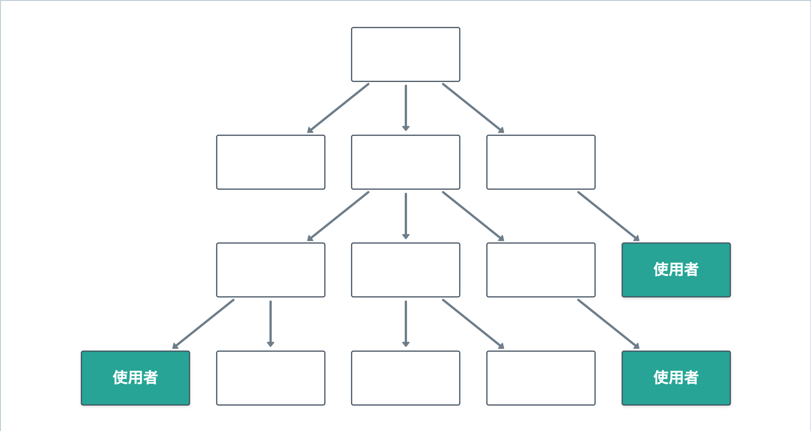
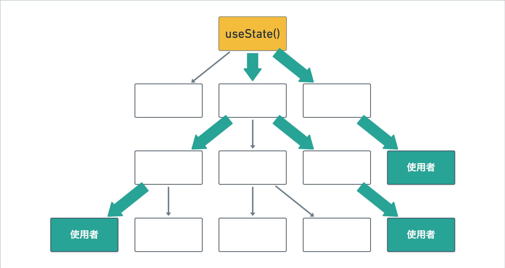

こんにちは。Reactの話題の中でもかなりの部分を占めるのがステート管理、さらに言えば各種のステート管理ライブラリです。今さらながら、Reactにおけるステート管理の概観や、いくつかのステート管理ライブラリの比較を記事にまとめてみました。

## `useState` + バケツリレー

Reactにおける基本的なステート管理は`useState`です。ひとつのコンポーネント内で完結するようなステートならば`useState`は非常に適しており、他の選択肢はほぼ無いと言っても構わないでしょう。

ステートをアプリケーションの広範囲で使いたい場合が問題です。次の画像に例示されるように、分岐したコンポーネントツリーの末端のコンポーネント（使用者）で同じステートを参照したい場合を考えます。

`useState`と組み合わせる場合、もっとも原始的な方法はpropsのバケツリレーによるものです。propsは親コンポーネントから子コンポーネントへの情報伝達の手段であり、Reactにおける最も基本的なコンポーネント間コミュニケーション手段です。これを図示したのが次の画像です。

プレーンなReactにおけるコンポーネント間の情報伝達は「親から子」が原則です。よって、複数のコンポーネントで共有されるステートは、必然的に共通祖先のコンポーネントに保持されることになります。上の図ではコンポーネントツリーの頂点にあるコンポーネントがステートを保持しています。このステートは末端の使用者までバケツリレーによって伝達されます（画像の太い矢印）。

### `useState` + バケツリレーの特徴: 責務の観点から

この方法の特徴は、**ステートの伝達に係る責務がステートの直接の使用者以外にも発生する**ことです。図では、上からステートを受け取ってそのまま下に流しているコンポーネントたちがこれに相当します。

一般に、コンポーネントは受け取るpropsをインターフェースとして明示します。インターフェースはそのコンポーネントの責務を表すものですから、コンポーネントにはそのpropsを受け取り適切に用いるという責務があることになります。

実際にこれらのコンポーネントが行なっているのは「propsを子に渡す」ということだけですが、Reactコンポーネントの場合「受け取ったpropsをどう使うか」ということ自体はコンポーネントの内部実装の範疇ですから責務ではなく、むしろ「渡されたpropsに応じて適切なUIを出し分ける」ことが責務となります。つまり、実際にはpropsで渡されたステートをバケツリレーしているだけのコンポーネントであっても、**インターフェース（責務）上はそのステートのれっきとした使用者となります**。

つまり、`useState` + バケツリレーという手法ではステートを子に渡すだけのコンポーネントと、本当にステートを使用するコンポーネントが、インターフェース上区別できないことになります。次の図のように、**実際の使用者に比べてインターフェース上のステート使用者が多くなります**。これが`useState` + バケツリレーという手法の特徴です。

よって、`useState` + バケツリレーという手法を採用するかどうかは、上記が実態と乖離するかどうかで決めればよいでしょう。すなわち、（バケツリレーの途中のコンポーネントも含めて）実態としてコンポーネントツリー上の多数のコンポーネントがステートを使用しているならば、`useState` + バケツリレーは適しています。一方、実際にはステートを使用しないがpropsに含んでいるというコンポーネントが多い場合、インターフェースと実態が乖離してしまう状況を生み出してしまうため、`useState` + バケツリレーは適していません。

### 即物的な見方

以上はインターフェース・責務というやや抽象的な観点から分析しましたが、これを基により即物的な見方をしてみましょう。

まず、`useState` + バケツリレーはパフォーマンス上不利になる可能性があります。使用者までの途中のコンポーネントも含めて多くのコンポーネントが実際にpropsとしてステートを受け取るということは、（たとえ`React.memo`などで再レンダリングを抑制していたとしても）ステートが変化した際にはそれらのコンポーネントが再レンダリングされることになります。これにより、実際に必要なよりも多くのコンポーネントがレンダリングされることになります。

また、リファクタリングの過程でステートの型や名前（propsの型や名前名前）が変わることも考えられます。その際、そのステートの型や名前をインターフェースに含んだコンポーネントが多ければそれだけ多くのコンポーネントを変更しなければなりません。これはいわゆる凝集度が低くなってしまっていることを表しています。

以上のことから、パフォーマンスやコードのメンテナンス性を重視する場合は、`useState` + バケツリレーは推奨されません。